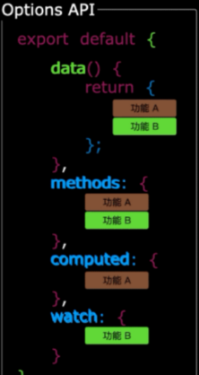
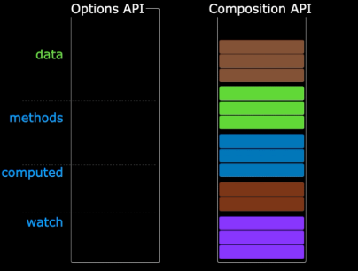
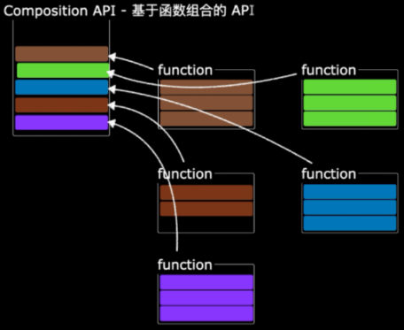
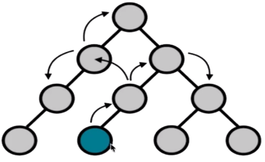
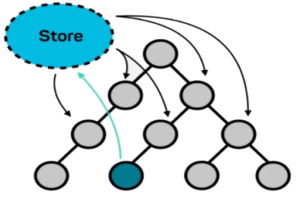
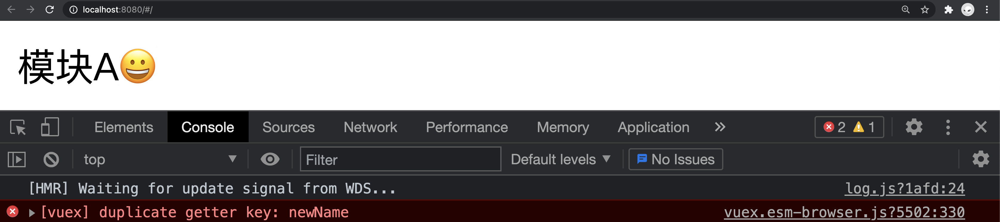

#  Vue3

## 1. 为什么学习 Vue3

> 目标: 了解学习 Vue3 的必要性。

- Vue3 运行性能大幅提升，速度是 Vue2 的 1.5 倍左右

- Vue3 支持 tree shaking，可以进行按需编译，编译后的文件体积比 Vue2 更小

- Vue3 组合式 API 使应用中的功能代码更聚合，使组件间公共逻辑的抽取更容易

- Vue3 对 TypeScript 的支持更加友好，对大型前端应用的支持更加游刃有余

- Vue3 中提供了更加先进的功能，比如 teleport，suspense 等

- Vue 是目前国内前端使用者最多的框架，Vue3 是将来的必然趋势


## 2. 组合式 API 的优势

> 目标：掌握组合式 API 相比较选项式 API，它的优势是什么。

在选项式API中，它将数据和逻辑进行了分离，所有不相关的数据被放置在了一起，所以不相关的逻辑被放置在了一起，随着应用规模的增加，项目将会变得越来越难以维护。

.

在组合式 API 中，它将同一个功能的逻辑和数据放置在了一起，使同一个的功能代码更加聚合。

.

同一个功能的代码可以被抽取到单独的文件中，使应用代码更好维护.

.

## 3. 组合式 API 入口

> 目标：掌握 setup 函数的基本使用。

------

`setup` 函数是一个新的组件选项，作为在组件中使用组合式 API 的入口,最先执行

`setup` 函数在任何生命周期函数之前执行，且函数内部 `this` 为 `undefined`，它不绑定组件实例对象

  Vue 3引入了Composition API。使用`getCurrentInstance`函数来获取当前组件实例。

`setup` 函数的返回值为对象类型，对象中的属性可以在其他选项和模板中使用, 因为对象中的属性会被添加到组件实例对象中

## 6. ref 和reactive区别

## 8. 计算属性 computed

> 目标：掌握使用 computed 函数创建计算属性的方式

------

- [ ] 说明 computed 方法的作用及使用方式
- [ ] 通过名字搜索案例学习 computed 方法的使用

------

接收回调函数作为参数，基于回调函数中使用的响应式数据进行计算属性的创建. 回调函数的返回值就是计算结果.

```javascript
import { ref, computed } from "vue"
export default {
  setup() {
    const names = ref([
      "林俊杰",
      "孙燕姿",
      "周杰伦",
      "张惠妹",
      "刘若英",
      "林宥嘉",
      "刘德华",
      "张韶涵",
      "周笔畅",
      "孙楠",
    ])
    const search = ref("")
    const filterNames = computed(() =>
      names.value.filter(name => name.includes(search.value))
    )
    return { search, filterNames }
  },
}
```

```html
<template>
  <input type="text" v-model="search" />
  <ul>
    <li v-for="name in filterNames">{{ name }}</li>
  </ul>
</template>
```

## 9. 监听状态 watch

> 目标：掌握 watch 函数监听数据的方式

------

- [ ] 说明 watch 函数的作用是什么
- [ ] 如何使用 watch 函数监听基于 ref 创建的响应式数据 (基本数据类型、引用数据类型)
- [ ] 如何使用 watch 监听响应式数据内部的具体属性 (基本数据类型、引用数据类型)
- [ ] 如何使用 watch 监听多个值的变化
- [ ] 说明 watch 方法中的 immediate 配置选项的作用 

------

watch 函数用于监听响应式数据的变化。

------

使用 watch 函数监听基于 ref 创建的响应式数据 (基本数据类型)。

```javascript
import { ref, watch } from "vue"
export default {
  setup() {
    const text = ref("")
    watch(text, (current, previous) => {
      console.log("current", current)
      console.log("previous", previous)
    })
    return { text }
  },
}
```

```html
<template>
  <input type="text" v-model="text" />
</template>
```

使用 watch 监听基于 ref 创建的响应式数据 (引用数据类型)。

```javascript
import { ref, watch } from "vue";

export default {
  name: "App",
  setup() {
    const person = ref({ name: "张三" });
    watch(person.value, (current) => {
      console.log(current);
    });
  },
};
```

```vue
<template>
  <button @click="onClickHandler">{{ person.name }}</button>
</template>
```

使用 watch 监听响应式数据内部的具体属性 (基本数据类型)

```javascript
import { ref, watch } from "vue";

export default {
  name: "App",
  setup() {
    const person = ref({ name: "张三" });
    watch(
      () => person.value.name,
      (current) => {
        console.log(current);
      }
    );
    return { person };
  },
};
```

------

使用 watch 监听响应式数据内部的具体属性 (引用数据类型)

```vue
<template>
  <p>{{ person.brand.title }} {{ person.name }}</p>
  <button @click="changeBrandTitle">title</button>
  <button @click="changeName">name</button>
</template>

<script>
import { ref, watch } from "vue";
export default {
  name: "App",
  setup() {
    const person = ref({ brand: { title: "宝马" }, name: "张三" });
    const changeBrandTitle = () => {
      person.value.brand.title = "奔驰";
    };
    const changeName = () => {
      person.value.name = "李四";
    };
    watch(person.value.brand, (current) => {
      console.log(current);
    });
    return { person, changeBrandTitle, changeName };
  },
};
</script>
```

使用 watch 监听基于 reactive 创建的响应式数据。

```javascript
import { reactive, watch } from "vue"
export default {
  setup() {
    const person = reactive({ name: "张三" })
    const onClickHandler = () => {
      person.name = "李四"
    }
    watch(person, (current, previous) => {
      console.log(current)
    })
    return { person, onClickHandler }
  },
}
```

```html
<template>
  {{ person.name }}
  <button @click="onClickHandler">button</button>
</template>
```

------

使用 watch 监听多个值的变化

```javascript
import { ref, watch } from "vue"
export default {
  setup() {
    const firstName = ref("")
    const lastName = ref("")
    watch([firstName, lastName], current => {
      console.log(current)
    })
    return { firstName, lastName }
  },
}
```

```html
<template>
  <input type="text" v-model="firstName" />
  <input type="text" v-model="lastName" />
</template>
```

使 watch 监听数据在初始时执行一次

```javascript
import { ref, watch } from "vue"
export default {
  setup() {
    const firstName = ref("hello")
    const lastName = ref("world")
    watch(
      [firstName, lastName],
      current => {
        console.log(current)
      },
      {
        immediate: true,
      }
    )
    return { firstName, lastName }
  },
}
```

## 10. 监听状态 watchEffect

> 目标：掌握使用 watchEffect 监听数据的方式

------

- [ ] 说明 watchEffect 方法的作用
- [ ] 说明 watchEffect 方法的使用方式

------

watchEffect 和 watch 一样，都是用于监听响应式数据的变化。

------

watchEffect 只关心数据的最新值，不关心旧值是什么，而且 watchEffect 默认会在初始时执行一次。

```javascript
import { ref, watchEffect } from "vue";

export default {
  name: "App",
  setup() {
    const firstName = ref("");
    const lastName = ref("");
    watchEffect(() => {
      console.log(firstName.value);
      console.log(lastName.value);
    });
    return { firstName, lastName };
  },
};
```

```html
<template>
  <input type="text" v-model="firstName" />
  <input type="text" v-model="lastName" />
</template>
```

## 11. toRef 函数

> 目标：掌握 toRef 函数的使用方式及应用场景

------

- [ ] 通过一段基础的 JavaScript 代码回顾基本数据类型的在赋值时的值传递特性, 为讲解 toRef 方法做铺垫
- [ ] 通过一段基础的 Vue 代码了解在不使用 toRef 方法时存在的问题
- [ ] 说明 toRef 方法的作用并使用 toRef 方法解决问题
- [ ] 说明 toRef 方法的应用场景

------

说出以下代码的输出结果是什么?

```javascript
let person = { name: "张三" };
let name = person.name;
person.name = "李四";
console.log(person.name); // "李四"
console.log(name); // ?
```

------

当按钮被点击时模板中的数据会发生更新吗?

```vue
<template>
  <p>{{ name }}</p>
  <p>{{ person }}</p>
  <button @click="onClickHandler">button</button>
</template>
<script>
import { ref } from "vue";
export default {
  name: "App",
  setup() {
    const person = ref({ name: "张三" });
    const onClickHandler = () => {
      person.value.name = "李四";
    };
    return {
      name: person.value.name,
      person,
      onClickHandler,
    };
  },
};
</script>
```

------

toRef 方法用于将响应式数据内部的普通数据转换为响应式数据，并且转换后的数据和原始数据存在引用关系，存在引用关系意味着当原始数据发生变化后，toRef 转换后的数据也会跟着变化。

```vue
<template>
  <p>{{ name }}</p>
  <p>{{ person }}</p>
  <button @click="onClickHandler">button</button>
</template>

<script>
import { ref, toRef } from "vue";
export default {
  name: "App",
  setup() {
    const person = ref({ name: "张三" });
    const onClickHandler = () => {
      person.value.name = "李四";
    };
    return {
      name: toRef(person.value, "name"),
      person,
      onClickHandler,
    };
  },
};
</script>
```

------

需求: 当响应式数据的结构层级比较深时，在模板中使用起来也比较繁琐，能不能在模板中使用时简化结构层级呢？

```javascript
export default {
  setup() {
    const person = ref({ brand: { name: "宝马" } });
    return { person }
  },
}
```

```html
<template>{{ person.brand.name }}</template>
```

如果能够将模板中的 `person.brand.name` 简化成 `brandName` 的话，模板代码会更加简洁，所以按照想法代码很自然的就写成了下面这样。

```vue
<template>
  <p>{{ person }}</p>
  <p>{{ brandName }}</p>
  <button @click="onClickHandler">button</button>
</template>

<script>
import { ref } from "vue";
export default {
  name: "App",
  setup() {
    const person = ref({ brand: { name: "宝马" } });
    const onClickHandler = () => {
      person.value.brand.name = "奔驰";
    };
    return {
      person,
      brandName: person.value.brand.name,
      onClickHandler,
    };
  },
};
</script>
```

```vue
<template>
  <p>{{ person }}</p>
  <p>{{ brandName }}</p>
  <button @click="onClickHandler">button</button>
</template>

<script>
import { ref, toRef } from "vue";
export default {
  name: "App",
  setup() {
    const person = ref({ brand: { name: "宝马" } });
    const onClickHandler = () => {
      person.value.brand.name = "奔驰";
    };
    return {
      person,
      brandName: toRef(person.value.brand, "name"),
      onClickHandler,
    };
  },
};
</script>
```

## 12. toRefs 函数

> 目标：掌握 toRefs 方法批量转换响应式数据的方式。

------

- [ ] 说明 toRefs 方法的作用是什么以及基本用法
- [ ] 通过例子验证 toRefs 方法的使用方式

------

通过 `toRef` 方法一次只能转换一个数据，通过 `toRefs` 方法可以实现批量数据转换。

toRefs 方法接收引用数据类型的响应式数据，它可以将数据中的第一层属性全部转换为响应式数据, 返回值是一个对象, 对象中存储了所有转换之后的响应式数据。

```javascript
import { reactive, toRefs } from "vue";

export default {
  name: "App",
  setup() {
    const person = reactive({
      name: "张三",
      age: 20,
      brand: { title: "宝马", year: 1 },
    });
    return { ...toRefs(person) };
  },
};
```

```vue
<template>{{ name }} {{ age }} {{ brand.title }} {{ brand.year }}</template>
```

对引用数据类型内部的数据进行转换

```javascript
import { reactive, toRefs } from "vue";

export default {
  name: "App",
  setup() {
    const person = reactive({
      name: "张三",
      age: 20,
      brand: { title: "宝马", year: 1 },
    });
    return { ...toRefs(person), ...toRefs(person.brand) };
  },
};
```

```vue
<template>{{ name }} {{ age }} {{ title }} {{ year }}</template>
```

## 13. 组件通讯

> 目标：掌握组合式 API 中父子组件通信的方式

------

- [ ] 讲解父组件如何向子组件传递数据
- [ ] 讲解子组件如何更改父组件传递过来的数据

------

父组件通过 props 向子组件传递数据

```html
<template>
  <div>I am parent component</div>
	<hr /> 
  <ChildComp :msg="msg"></ChildComp>
</template>

<script>
import ChildComp from "./components/ChildComp.vue"
import { ref } from "vue"
export default {
  components: { ChildComp },
  setup() {
    const msg = ref("a message from parent")
    return { msg }
  },
}
</script>
```

```vue
<template>
  <div>
    {{ childMsg }}
    <hr />
    {{ msg }}
  </div>
</template>
<script>
import { computed } from "vue";
export default {
  name: "ChildComponent",
  props: ["msg"],
  setup(props) {
    // 当父组件更新 props 时 setup 函数是不会重新执行的
    // 所以在 setup 函数中使用 props 时需要用到 computed 或者 watch 来响应 props 的变化
    // 注意: 直接在模板中使用 props 数据是没有这个问题的
    const childMsg = computed(() => props.msg + "😀😀");
    return { childMsg };
  },
};
</script>
```

子组件通过自定义事件向父组件传递数据

```vue
<template>
	<div>
    {{ childMsg }}
    <hr />
    {{ msg }}
    <hr />
    <button @click="onMsgChanged">change msg</button>
  </div>
</template>
<script>
import { computed } from "vue";

export default {
  name: "ChildComponent",
  props: ["msg"],
  setup(props, { emit }) {
    const onMsgChanged = () => {
      emit("onMsgChanged", "changed msg from children");
    };
    return { onMsgChanged };
  },
};
</script>
```

```html
<template>
  <ChildComponent :msg="msg" @onMsgChanged="onMsgChanged" />
</template>

<script>
import { ref } from "vue";
import ChildComponent from "./components/child-component.vue";
export default {
  components: { ChildComponent },
  name: "App",
  setup() {
    const msg = ref("i am a message");
    const onMsgChanged = (data) => {
      msg.value = data;
    };
    return { msg, onMsgChanged };
  },
};
</script>

```

注意事项：在 Vue2 中，模板需要被一个根元素包裹，但是在 Vue3 中是不需要的，Vue3 支持在模板中编写代码片段。

```vue
<template>
  <div>{{ childMsg }}</div>
  <button @click="onClickHandler">change msg</button>
</template>
```

如果在模板中使用代码片段, 自定义事件需要被显式的声明在 emits 选项中.

```javascript
emits: ["onMsgChanged"],
```

## 14. 组件生命周期

> 目标：掌握组件生命周期函数的使用方式  [VUE3 生命周期函数](https://v3.cn.vuejs.org/guide/composition-api-lifecycle-hooks.html)

------

- [ ] 说明 setup 函数的执行时机
- [ ] 说明 onMounted、onUpdated、onUnmounted 组件生命周期函数的执行时机

------

`setup`: Vue3 中组合式 API 的入口, 它会在创建组件实例对象前执行, 会在每次组件重新挂载时执行。

创建组件实例对象前执行 

```javascript
export default {
  setup() {
    console.log('setup')
  },
  beforeCreate() {
    console.log("before create")
  },
}
```

每次组件重新挂载时执行

```vue
<!-- App组件 父组件  -->
<template>
  <button @click="show = !show">toggle</button>
  <ChildComponent v-if="show"></ChildComponent>
</template>

<script>
import { ref } from "vue";
import ChildComponent from "./components/child-component.vue";
export default {
  components: { ChildComponent },
  name: "App",
  setup() {
    const show = ref(true);
    return { show };
  },
};
</script>
```

```vue
<!-- ChildComponent 组件 子组件 -->
<template>child component</template>
<script>
export default {
  name: "ChildComponent",
  setup() {
    // setup 函数会在组件每次重新渲染时执行
    console.log("setup");
  },
};
</script>
```

`onMounted` 组件挂载完成后执行

`onUpdated` 组件数据更新后执行

`onUnmounted` 组件卸载后执行

```vue
<!-- child-component  -->
<template>{{ count }} <button @click="onClickHandler">button</button></template>
<script>
import { onMounted, onUnmounted, onUpdated, ref } from "vue";

export default {
  name: "ChildComponent",
  setup() {
    let timer = null;
    // 组件挂载完成之后开启定时器
    onMounted(() => {
      timer = setInterval(() => {
        console.log("timer...");
      }, 1000);
    });
    // 组件卸载完成之后清除定时器
    onUnmounted(() => {
      clearInterval(timer);
    });
    const count = ref(0);
    const onClickHandler = () => {
      count.value = count.value + 1;
    };
    // 组件更新之后在控制台中输出 onUpdated
    onUpdated(() => {
      console.log("onUpdated");
    });
    return { count, onClickHandler };
  },
};
</script>
```

## 15. 与服务端通信

> 目标：掌握在组合式 API 中实现与服务器端通讯的方式

------

- [ ] 通过例子说明如何在组合式 API 中实现与服务器端通讯的方式
- [ ] 讲解抽取可重用逻辑的方式, 充分发挥组合式API的优势

------

向服务器端发送请求获取列表数据渲染列表数据, 没有数据要显示暂无数据, 如果请求报错展示错误信息, 加载过程显示loading.

```vue
<script>
import { ref } from "vue";
import axios from "axios";
  
export default {
  name: "App",
  setup() {
    // 用于存储列表数据
    const data = ref(null);
    // 用于标识加载状态
    const loading = ref(false);
    // 用于存储错误信息
    const error = ref(null);
    // 用于发送请求的方法
    async function getPosts() {
      // 更新加载状态
      loading.value = true;
      try {
        // 发送请求
        let response = await axios.get(
          "https://jsonplaceholder.typicode.com/posts"
        );
        // 存储列表数据
        data.value = response.data;
      } catch (err) {
        // 存储错误信息
        error.value = err.message;
      }
      // 更新加载状态
      loading.value = false;
    }
    // 调用方法 发送请求
    getPosts();
    // 返回模板所需数据
    return { data, loading, error };
  },
};
</script>
```

```html
<template>
  <div v-if="loading">loading...</div>
  <div v-else-if="error">{{ error }}</div>
  <div v-else-if="data && data.length > 0">
    <ul>
      <li v-for="item in data">{{ item.title }}</li>
    </ul>
  </div>
  <div v-else>暂无数据</div>
</template>
```

注意: 如果在导入 axios 时报错，重新启动应用程序即可。

将获取 Posts 数据的逻辑抽取单独文件中，使其可以在多个组件中被重复使用。

```javascript
export default {
  name: "App",
  setup() {
    const { data, loading, error, getPosts } = usePosts();
    getPosts();
    return { data, loading, error };
  },
};
```

```javascript
import { ref } from "vue";
import axios from "axios";

function usePosts() {
  const data = ref(null);
  const loading = ref(false);
  const error = ref(null);
  async function getPosts() {
    loading.value = true;
    try {
      let response = await axios.get(
        "https://jsonplaceholder.typicode.com/posts"
      );
      data.value = response.data;
    } catch (err) {
      error.value = err.message;
    }
    loading.value = false;
  }
  return { data, loading, error, getPosts };
}
```

## 16. 获取 DOM 对象

> 目标：掌握在组合式 API 中获取 DOM 对象的方式

------

- [ ] 说明如何使用 ref 获取单个 DOM 对象
- [ ] 说明如何使用 ref 获取一组 DOM 对象

------

获取单个 DOM 对象

```javascript
import { ref, onMounted } from "vue"
export default {
  setup() {
    const divRef = ref(null)
    onMounted(() => {
      console.log(divRef.value)
    })
    return { divRef }
  },
}
```

```html
<template>
  <div ref="divRef">Hello Ref</div>
</template>
```

获取一组 DOM 对象

```javascript
import { ref, onMounted, onUpdated } from "vue"
export default {
  setup() {
    const list = ref(["a", "b", "c"])
    const elms = ref([])
    const onClickHandler = () => list.value.push("d")
    onMounted(() => console.log(elms.value))
    onUpdated(() => console.log(elms.value))
    return { list, elms, onClickHandler }
  },
}
```

```html
<template>
  <ul>
    <li v-for="(item, index) in list" :key="index" :ref="(el) => (elms[index] = el)">
      {{ item }}
    </li>
  </ul>
  <button @click="onClickHandler">button</button>
</template>
```

## 17. provide、inject 函数

> 目标：掌握跨组件层级传递数据的方式

通过 provide、inject 函数的配合使用，可以实现跨组件传递数据（组件与组件存在嵌套关系）

```vue
<!-- 父组件 App -->
<template>
  <ChildComponent />
</template>

<script>
import { ref, provide } from "vue";
import ChildComponent from "./components/ChildComponent.vue";

export default {
  components: { ChildComponent },
  name: "App",
  setup() {
    const person = ref({ name: "张三" });
    const changePerson = () => {
      person.value.name = "李四";
    };
    provide("person", person);
    provide("changePerson", changePerson);
  },
};
</script>
```

```html
<!-- 子组件 -->
<template>
  <LastComponent />
</template>
<script>
import LastComponent from "./LastComponent.vue";
export default {
  components: { LastComponent },
  name: "ChildComponent",
};
</script>
```

```html
<!-- 孙组件 -->
<template>
  {{ person.name }}
  <button @click="changePerson">button</button>
</template>
<script>
import { inject } from "vue";
export default {
  name: "LastComponent",
  setup() {
    const person = inject("person");
    const changePerson = inject("changePerson");
    return { person, changePerson };
  },
};
</script>
```

## 18. teleport 组件

> 目标：掌握 teleport 组件的使用方式

------

- [ ] 说明 teleport 组件的作用
- [ ] 通过案例验证 teleport 组件的用法

------

teleport 组件可以将指定组件渲染到应用外部的其他位置。

比如弹框组件，它可能在任意组件中使用，但它不属于任意组件，所以不能在使用它的组件中渲染它，我们需要将它渲染到指定位置。

```vue
<!-- Modal.vue -->
<template>
  <div class="wrapper">
    <div class="content">
      <a class="close" href="javascript:">关闭</a>
    </div>
  </div>
</template>
<script>
export default {
  name: "Modal",
};
</script>
<style scoped>
.wrapper {
  position: absolute;
  left: 0;
  top: 0;
  right: 0;
  bottom: 0;
  background: rgba(0, 0, 0, 0.4);
}
.content {
  width: 660px;
  height: 400px;
  background: white;
  position: absolute;
  left: 50%;
  top: 50%;
  transform: translate(-50%, -50%);
}
.close {
  position: absolute;
  right: 10px;
  top: 10px;
  color: #999;
  text-decoration: none;
}
</style>
```

```html
<!-- App.vue -->
<template>
  <teleport to="#modal">
    <Modal />
  </teleport>
</template>
<script>
import Modal from "./components/Modal.vue";
export default {
  components: { Modal },
  name: "App",
};
</script>
```

```html
<!-- index.html -->
<div id="modal"></div>
```

## 19. Suspense 组件

> 目标：掌握 Suspense 组件的使用方式

------

- [ ] 说明 suspense 组件的作用及使用场景
- [ ] 通过代码验证 suspense 组件的使用方式

------

Suspense 用于确保组件中的 setup 函数调用和模板渲染之间的执行顺序。先执行 setup 后渲染模板。

当组件中的 setup 被写成异步函数的形式, 代码执行的顺序就变成了先渲染模板后执行 setup 函数了。

```vue
<!-- Posts.vue -->
<template>
  <pre>{{ data }}</pre>
</template>
<script>
import axios from "axios";

export default {
  name: "Posts",
  async setup() {
    let response = await axios.get(
      "https://jsonplaceholder.typicode.com/posts"
    );
    return { data: response.data };
  },
};
</script>
```

```vue
<!-- App.vue -->
<template>
  <Suspense>
    <Posts />
  </Suspense>
</template>
<script>
import Posts from "./components/Posts.vue";
export default {
  components: { Posts },
  name: "App",
};
</script>
```

通过 suspense 组件还可以为异步操作添加等待提示效果。

```html
<!-- App.vue -->
<template>
  <Suspense>
    <template v-slot:default>
      <Posts />
    </template>
    <template v-slot:fallback> loading... </template>
  </Suspense>
</template>
<script>
import Posts from "./components/Posts.vue";
export default {
  components: { Posts },
  name: "App",
};
</script>
```

## 20. 过渡动画

> 目标：掌握 transition 组件的使用方式

### 20.1 概述

Vue 提供了 transition 组件供我们执行过渡动画, 我们只需要使用 transition 组件包裹你要执行动画的元素即可。

执行过渡动画的前提条件是元素具有创建与销毁的操作。

```vue
<transition>
  <h1>hello world</h1>
</transition>
```

当创建元素时, transiton 组件会为执行动画的元素添加三个类名, 我们可以通过这三个类名为元素添加入场动画。

```css
.v-enter-from {}    // 元素执行动画的初始样式 (动画起点样式)
.v-enter-to {}      // 元素执行动画的目标样式 (动画终点样式)
.v-enter-active {}  // 可以用于指定元素指定动画的类型
```

```css
.v-enter-from { opacity: 0 }
.v-enter-to { opacity: 1 }
.v-enter-active { transition: opacity 2s ease-in } // ease-in 先慢后快
```

当销毁元素时, transition 组件会为执行动画的元素添加三个类名, 我们可以通过这个三个类名为元素添加离场动画样式。

```css
.v-leave-from {}      // 元素执行动画的初始样式 (动画起点样式)
.v-leave-to {}        // 元素执行动画的目标样式 (动画终点样式)
.v-leave-active {}    // 可以用于指定元素指定动画的类型
```

```css
.v-leave-from { opacity: 1 }
.v-leave-to { opacity: 0 }
.v-leave-active { transition: opacity 2s ease-out } // ease-out 先快后慢
```

如果在页面中有多个元素要执行动画, 而多个元素要执行的动画不同时, 为了对多个元素的动画样式进行区分, 在调用 transiton 组件时需要为它添加 name 属性以区分样式类名。

```vue
<transition name="fade">
  <h1>hello world</h1>
</transition>
```

```css
.fade-enter-from {}
.fade-enter-to {}
.fade-enter-active{}

.fade-leave-from {}
.fade-leave-to {}
.fade-leave-active {}
```

### 20.2 示例

需求: 点击按钮让元素显示隐藏 (执行动画)

```vue
<transition name="fade">
  <h2 v-if="show">hello world</h2>
</transition>
<button @click="show = !show">button</button>
```

```javascript
const show = ref(false);
```

```css
.fade-enter-from {
  opacity: 0;
}
.fade-enter-to {
  opacity: 1;
}
.fade-enter-active {
  transition: opacity 2s ease-in;
}

.fade-leave-from {
  opacity: 1;
}
.fade-leave-to {
  opacity: 0;
}
.fade-leave-active {
  transition: opacity 2s ease-out;
}
```

## 21. 状态管理 Vuex

> 掌握 Vuex 实现全局状态管理的方式

### 21.1 问题

在不使用全局状态管理库时, 应用状态由组件管理, 当多个组件需要共享使用同一个应用状态时, 应用状态需要通过 props 或自定义事件在组件之间进行传递, 在组件与组件之间的关系比较疏远时, 手递手的这种传递方式显得特别混乱, 使得应用的维护变得困难.



  

在使用了全局状态管理库后, 需要共享的应用状态被单独存储在一个独立于组件的 Store 对象中, 所有组件可以直接从这个对象中获取状态, 省去了繁琐的组件状态传递过程. 而且当 Store 中的状态发生变化后，组件也会自动更新。



### 21.2 Vuex 工作流程

State: 用于存储应用状态 (store.state)

Action: 用于执行异步操作，不能在此处直接修改状态 (dispatch)

Mutation: 用于执行同步操作，修改 state 中的应用状态 (commit)

Getter: vuex 中的计算属性 (store.getters)

Module: 模块, 用于对状态进行拆分

在组件中开发者可以调用 dispatch 方法触发 Action 执行异步操作, 当异步操作执行完成后, 在 Action 中可以继续调用 commit 方法触发 mutation 修改状态, 当状态被修改以后, 视图更新. 


### 21.3 下载

Vuex 目前有两个版本, 一个是 `3.6.2`, 另一个是 `4.0.2`, 3.x 的版本是供 Vue2 使用的, 4.x 版本是供 Vue3 使用的.

在下载 Vuex 的时候如果不加版本号，默认下载的是 3.x 版本, 而我们要使用的是 4.x 的版本, 所以在下载时千万记得加版本号.

`npm install vuex@4.0.2`

### 21.4 创建 Store

```javascript
// src/store/index.js
import { createStore } from 'vuex'
export default createStore({})
```

```javascript
// src/main.js
import store from './store'
const app = createApp(App)
app.use(store)
```

### 21.5 state

在应用状态对象中存储 `username` 状态.

```javascript
export default createStore({
  state: {
    username: '张三'
  }
})
```

在组件中获取 `username` 状态

```html
<template>
  {{$store.state.username}}
</template>
```

```vue
<script>
import { useStore } from 'vuex'
export default {
  setup () {
    const store = useStore()
    console.log(store.state.username)
  }
}
</script>
```

### 21.6 getters

getters 是 vuex 中的计算属性, 基于现有状态计算出新的状态。

```javascript
export default createStore({
  getters: {
    newUsername (state) {
      return state.username + '😀😀😀😀'
    }
  }
})
```

```vue
<template>
  {{$store.getters.newUsername}}
</template>
```

```vue
<script>
export default {
  setup () {
    console.log(store.getters.newUsername)
  }
}
</script>
```

### 21.7 mutations

mutations 是 vuex 中用于修改状态的方法。

```javascript
export default createStore({
  mutations: {
    updateUsername (state, username) {
      state.username = username
    }
  }
})
```

```html
<template>
  <button @click="$store.commit('updateUsername', '李四')">
    change username
  </button>
</template>
```

### 21.8 actions

actions 在 Vuex 中用于执行异步操作, 当异步操作执行完成以后可以调用 commit 方法触发 mutation 来修改应用状态

```javascript
export default createStore({
  actions: {
    updateName (ctx) {
      setTimeout(() => {
        ctx.commit('updateName', '李四')
      }, 1000)
    }
  }
})
```

```html
<template>
  <button @click="onClickHandler">button</button>
</template>
<script>
export default {
  setup () {
    const onClickHandler = () => {
      store.dispatch('updateName')
    }
    return { onClickHandler }
  }
}
</script>
```

### 21.9 module

#### 21.9.1 概述

Vuex 允许开发者通过模块对状态进行拆分，允许开发者将不同功能的状态代码拆分到不同的模块中。

模块分为两种，一种是不具备命名空间的模块，另一种是具备命名空间的模块，推荐使用命名空间，命名空间使模块更加独立。

#### 21.9.2 非命名空间模块

```javascript
import { createStore } from 'vuex'

const moduleA = {
  state () {
    return {
      name: '模块A'
    }
  }
}
const moduleB = {
  state () {
    return {
      name: '模块B'
    }
  }
}

export default createStore({
  modules: {
    a: moduleA,
    b: moduleB
  }
})
```

```html
<template>
  {{$store.state['a'].name}}
  {{$store.state['b'].name}}
</template>
<script>
import { useStore } from 'vuex'
export default {
  name: 'App',
  setup () {
    const store = useStore()
    console.log(store.state.a.name)
    console.log(store.state.b.name)
  }
}
</script>
```

非命名空间模块中的 mutation 方法, 当 `updateName` 方法被触发后，所有定义了此方法的模块都会调用该方法。

```javascript
import { createStore } from 'vuex'

const moduleA = {
  mutations: {
    updateName (state) {
      state.name = '😀模块A😀'
    }
  }
}
const moduleB = {
  mutations: {
    updateName (state) {
      state.name = '😝模块B😝'
    }
  }
}

export default createStore({
  modules: {
    a: moduleA,
    b: moduleB
  }
})
```

```html
<template>
  {{$store.state['a'].name}}
  {{$store.state['b'].name}}
  <button @click="$store.commit('updateName')">updateName</button>
</template>
```

非命名空间模块中的 getter，不能在两个模块中定义相同的 `getter` 以避免程序报错。

```javascript
import { createStore } from 'vuex'

const moduleA = {
  getters: {
    newName (state) {
      return state.name + '😀'
    }
  }
}
const moduleB = {
  getters: {
    newName (state) {
      return state.name + '😝'
    }
  }
}

export default createStore({
  modules: {
    a: moduleA,
    b: moduleB
  }
})
```

```html
<template>
  {{$store.getters.newName}}
</template>
```



#### 21.9.3 命名空间模块

命名空间模块需要在模块对象中添加 `namespaced: true` 选项。

```javascript
import { createStore } from 'vuex'

const moduleA = {
  namespaced: true,
  state () {
    return { name: '模块A' }
  }
}
const moduleB = {
  namespaced: true,
  state () {
    return { name: '模块B' }
  }
}

export default createStore({
  modules: {
    a: moduleA,
    b: moduleB
  }
})
```

```html
<template>
  {{$store.state['a'].name}}
  {{$store.state['b'].name}}
</template>
```

具有命名空间的模块状态更加独立，比如可以在不同的命令空间中定义相同的 `getter`

```javascript
import { createStore } from 'vuex'

const moduleA = {
  namespaced: true,
  getters: {
    newName (state) {
      return state.name + '😀'
    }
  }
}
const moduleB = {
  namespaced: true,
  getters: {
    newName (state) {
      return state.name + '😀'
    }
  }
}

export default createStore({
  modules: {
    a: moduleA,
    b: moduleB
  }
})
```

```html
<template>
  {{$store.getters['a/newName']}}
  {{$store.getters['b/newName']}}
</template>
```

在不同的命名空间模块中定义相同的变异方法

```javascript
import { createStore } from 'vuex'

const moduleA = {
  namespaced: true,
  mutations: {
    updateName (state) {
      state.name = '我是模块A'
    }
  }
}
const moduleB = {
  namespaced: true,
  mutations: {
    updateName (state) {
      state.name = '我是模块B'
    }
  }
}

export default createStore({
  modules: {
    a: moduleA,
    b: moduleB
  }
})
```

```vue
<template>
  {{$store.getters['a/newName']}}
  {{$store.getters['b/newName']}}
  <button @click="$store.commit('a/updateName')">update moduleA</button>
  <button @click="$store.commit('b/updateName')">update moduleb</button>
</template>
```

## 22. 双向数据绑定

> 目标: 掌握实现双向数据绑定的方式

------

- [ ] 实现表单元素的双向数据绑定
- [ ] 实现组件的双向数据绑定

------

### 22.1 实现表单双向数据绑定

**1. 什么是双向数据绑定?**

双向指的是视图(template)和逻辑(script), 双向数据绑定是指视图更新数据后自动同步到逻辑, 逻辑更新数据后自动同步到视图。

**2. 如何实现双向数据绑定?**

```vue
<template>
  <input type="text" v-model="firstName" />
  <button @click="onClickHandler">button</button>
</template>
<script>
import { ref } from "vue";
export default {
  setup() {
    const firstName = ref("张三");
    const onClickHandler = () => {
      firstName.value = "李四";
    };
    return { firstName, onClickHandler };
  },
};
</script>
```

**3. 如何监听双向数据绑定中数据的变化**

```vue
<template>
  <input
    type="text"
    v-model="firstName"
    @update:modelValue="onFirstNameChanged($event)"
  />
</template>
<script>
import { ref } from "vue";
export default {
  setup() {
    const firstName = ref("张三");
    const onFirstNameChanged = (event) => {
      console.log(event);
    };
    return { firstName, onFirstNameChanged };
  },
};
</script>
```

### 22.2 实现组件双向数据绑定

#### 1. 普通版

`App.vue`

```vue
<template>
  <Test
    :firstName="firstName"
    @onFirstNameChanged="onFirstNameChanged($event)"
  />
  <button @click="onClickHandler">我是App组件中的 button</button>
</template>
<script>
import Test from "./components/Test.vue";
import { ref } from "vue";
export default {
  components: { Test },
  name: "App",
  setup() {
    const firstName = ref("张三");
    const onClickHandler = () => {
      firstName.value = "李四";
    };
    const onFirstNameChanged = (event) => {
      firstName.value = event;
    };
    return { firstName, onClickHandler, onFirstNameChanged };
  },
};
</script>
```

`Test.vue`

```vue
<template>
  <div>
    {{ firstName }}
    <button @click="onClickHandler">我是Test组件中的button</button>
  </div>
</template>
<script>
export default {
  props: ["firstName"],
  setup(props, { emit }) {
    const onClickHandler = () => {
      emit("onFirstNameChanged", "王五");
    };
    return { onClickHandler };
  },
};
</script>
```

#### 2. 升级版

`App.vue`

```vue
<template>
  <Test v-model="firstName" />
  <button @click="onClickHandler">我是App组件中的 button</button>
</template>
<script>
import Test from "./components/Test.vue";
import { ref } from "vue";
export default {
  components: { Test },
  name: "App",
  setup() {
    const firstName = ref("张三");
    const onClickHandler = () => {
      firstName.value = "李四";
    };
    return { firstName, onClickHandler };
  },
};
</script>
```

`Test.vue`

```vue
<template>
  <div>
    {{ modelValue }}
    <button @click="onClickHandler">我是Test组件中的button</button>
  </div>
</template>
<script>
export default {
  props: ["modelValue"],
  setup(props, { emit }) {
    const onClickHandler = () => {
      emit("update:modelValue", "王五");
    };
    return { onClickHandler };
  },
};
</script>
```

#### 3. 终极版

`App.vue`

```vue
<template>
  <Test v-model:firstName="firstName" v-model:lastName="lastName" />
  <button @click="onClickHandler">我是App组件中的 button</button>
</template>
<script>
import Test from "./components/Test.vue";
import { ref } from "vue";
export default {
  components: { Test },
  name: "App",
  setup() {
    const firstName = ref("张三");
    const lastName = ref("李四");
    const onClickHandler = () => {
      firstName.value = "孙悟空";
      lastName.value = "猪八戒";
    };
    return { firstName, lastName, onClickHandler };
  },
};
</script>
```

`Test.vue`

```react
<template>
  <div>
    {{ firstName }} {{ lastName }}
    <button @click="onClickHandler">我是Test组件中的button</button>
  </div>
</template>
<script>
export default {
  props: ["firstName", "lastName"],
  setup(props, { emit }) {
    const onClickHandler = () => {
      emit("update:firstName", "刘备");
      emit("update:lastName", "诸葛亮");
    };
    return { onClickHandler };
  },
};
</script>
```

## 23. customRef

### 23.1 复习防抖

防抖: 监听用户的连续操作, 最终只响应连续操作中的最后一次操作。

```vue
<template>
  <button @click="onClickHandler">button</button>
</template>
<script>
export default {
  name: "App",
  setup() {
    const onClickHandler = debounce(() => {
      console.log("onClickHandler");
    }, 400);
    return { onClickHandler };
  },
};
function debounce(handler, delay) {
  let timer = null;
  return function () {
    clearTimeout(timer);
    timer = setTimeout(() => {
      handler.call(this, arguments);
    }, delay);
  };
}
</script>
```

### 23.2 customRef

创建具有自定义行为的响应式数据, 通过拦截响应式数据的读取和设置实现。

需求: 创建具有防抖功能的响应式数据。监听对响应式数据的连续更改, 只响应最后一次更改。

```vue
<template>
  <input type="text" v-model="keyword" />
  {{ keyword }}
</template>
<script>
import { customRef } from "vue";
export default {
  name: "App",
  setup() {
    const keyword = useDebounceRef("Hello", 400);
    return { keyword };
  },
};

function useDebounceRef(initialValue, delay) {
  let timer = null;
  return customRef((track, trigger) => {
    return {
      get() {
        // 跟踪 initialValue 值的变量
        track();
        return initialValue;
      },
      set(newValue) {
        clearTimeout(timer);
        timer = setTimeout(() => {
          initialValue = newValue;
          // 触发视图更新
          trigger();
        }, delay);
      },
    };
  });
}
</script>
```

## 24. 代理对象

> 目标: 了解代理对象的使用方式

什么是数据响应式?

数据驱动视图, 即数据和视图进行绑定, 当数据发生变化后, 视图自动更新.

如何实现数据响应式?

实现数据响应式的核心在于监听数据的变化, 当数据发生变化后, 执行视图更新操作.

Vue3 使用代理对象监听数据变化.

创建对象的代理对象, 从而实现对对象操作的拦截和自定义.

```javascript
// person 对象, 源数据对象
const person = { name: "张三", age: 20 };
// p 对象, person 对象的代理对象
// 对 p 对象进行的所有操作都会映射到 person 对象
const p = new Proxy(person, {});
// 查询代码对象
console.log(p); // Proxy { name: "张三", age: 20 }
// 修改代理对象中的 name 属性
p.name = "李四";
// 输出源数据对象中的 name 属性
console.log(person.name); // 李四
// 删除代理对象中的 age 属性
delete p.age;
// 输出源数据对象中的 age 属性
console.log(person.age); // undefined
// 在代理对象中增加 sex 属性
p.sex = "男";
// 输出源数据对象中的 sex 属性
console.log(person.sex);
```

```javascript
// person 对象, 源数据对象
const person = {
  name: "张三",
  age: 20,
  brand: { group: { title: "宝马" } },
};
// p 对象, person 对象的代理对象
// 对 p 对象进行的所有操作都会映射到 person 对象
const p = new Proxy(person, {
  get(target, property) {
    console.log("拦击到了获取操作");
    return target[property];
  },
  set(target, property, value) {
    console.log("拦截到了设置或者新增操作");
    target[property] = value;
  },
  deleteProperty(target, property) {
    console.log("拦截到了删除操作");
    return delete target[property];
  },
});

// console.log(p.name);
// p.name = "李四";
// delete p.name;
// p.sex = "男";
// proxy 代理的是整个对象, 不论对象层级有多深, 都可以进行拦截.
console.log(p.brand.group.title);

console.log(person);
```